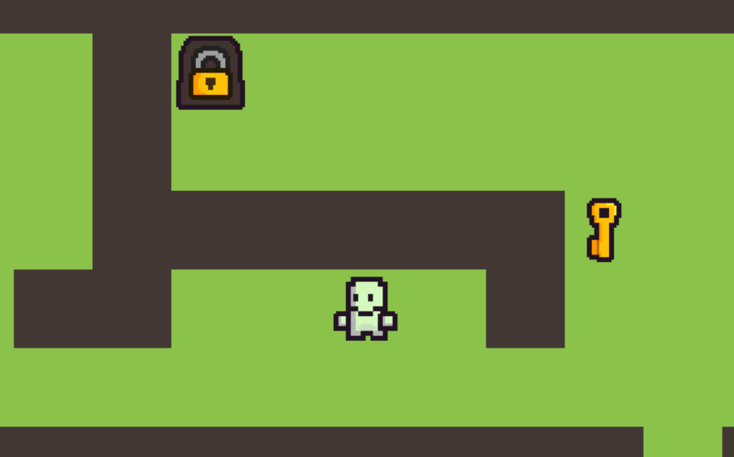
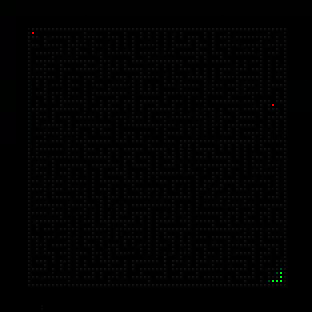
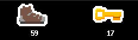
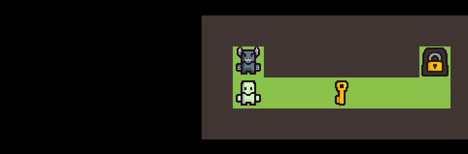

# SO_LONG

**so_long** is a 2D maze-based game developed as part of the 42 curriculum.  
The project is built using **MiniLibX**, a lightweight graphical library provided by 42, and focuses on fundamental concepts such as window management, event handling, textures, and basic game logic.

## Overview

The goal of the game is to navigate through a maze, collect all collectibles, and reach the exit while avoiding obstacles.  
The player must carefully plan their movements to complete the map successfully.

<p align="center">
  
</p>

## Features

- 2D top-down maze gameplay  
- Keyboard-based player movement  
- Collectibles and exit system  
- Map validation and error handling  
- Custom-made graphical assets  
- Smooth rendering using MiniLibX  

<p align="center">
  
</p>

## Bonus Features

### Pathfinding

In addition to the mandatory requirements, the project includes a **pathfinding system**.  
Since I wanted to show it to my peer, I added this visualization at the beginning of the game.  
This feature displays the path used to validate map solvability and helps visualize how the player can reach all collectibles and the exit.

<p align="center">
  
</p>

### HUD

To keep track of the player’s progress, I implemented a **HUD** that shows both the number of steps taken and the remaining keys on the map.  
The subject only asked for text display, but I decided to create a graphical HUD for a cleaner and more visually appealing interface.

<p align="center">
  
</p>

### Sprite Animations

The game includes simple frame animations. For example, the door changes its sprite when opened, and enemies track the player by turning to face them.

<p align="center">
  
</p>

## Compilation

To compile the mandatory version:

```bash
make
```

To compile the bonus version:

```bash
make bonus
```

## Usage

Run the game by providing a map file as an argument:

```bash
./so_long path_to_map.ber
```

Several example maps are available in the following directory:

`srcs/maps/`

Custom maps must follow the .ber format and project specifications.

## Assets

All assets used in this project were entirely drawn by hand.
The visual style was designed to be coherent and distinctive while remaining readable during gameplay.
